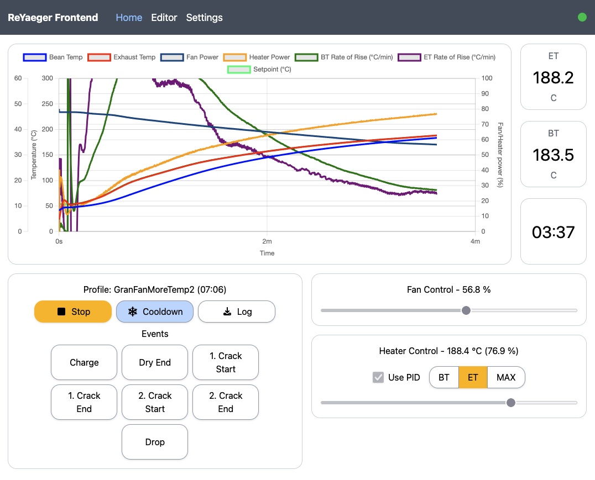
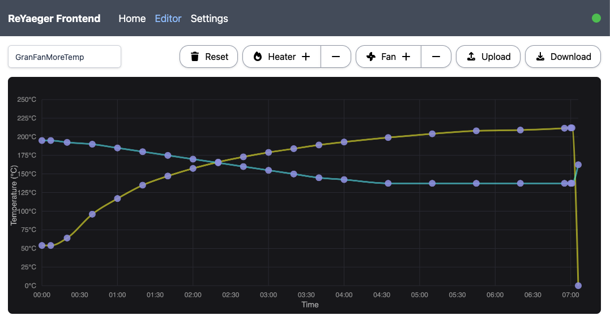

# ReYaeger

This is an alternative frontend for the Yaeger roaster firmware. It can be hosted with the yaeger firmware on an ESP32 S3.

# Key Improvements

- Rebuilt from scratch in React - still small enough  to fit on the ESP32 S3 Mini, yet way more common than VanJS, which should make outside contributions easier.
- Visual Profile Editor: Define the key temperature and fan values for your Profile by moving them around, let ReYaeger connect the dots smoothly.
- Controlled Messaging Loop: Ensures the ESP32 does drop the socket connection. 10 updates per second, any PID or manual changes piggyback on those 10 packets. Can be increased further with some Chart optimizations.
- Persistence for PID values and other preferences.
- Responsive layout, if you like roasting on your phone.
- Persistence for recent profiles (LocalStorage only, might disappear after a while).
- Improved manual controls for temperature and fan speed (also supports keyboard inputs using WASD).

# Install

While I work with [@tadelv](https://github.com/tadelv) to integrate this frontend with yaeger in a clean way, you can use this [fork & branch](https://github.com/RobTS/yaeger/tree/chore/reyaeger-extensions) to build and flash everything using the familiar `build_and_flash.sh` script (choose `r` for reyaeger when prompted).

## Manual install

Download the zip file from the release page, drop it into the `data` folder (create if it does not exist) of your [Yaeger](https://github.com/tadelv/yaeger) project, then remove the line starting with `npm run build` step from Yaeger's `build_and_flash.sh`.

Follow Yaeger's remaining installation instructions and you should end up with a working reyaeger frontend under [http://yaeger.local](http://yaeger.local).

## Build from Source

To build this project from source, ensure you have NodeJS >= 20 running, then run `corepack enable`, after which you should be able to install your dependencies running `yarn install`.

Lastly, you can bundle the project running `yarn run build:release`. The resulting bundled frontend will be available in the `dist` folder, or zipped in the `release` folder.

# Disclaimer

Be careful when messing about with electronics and high voltage. I can not and will not take any responsibility for any sort of damage or injury caused by Yaeger, either directly or indirectly. You do this at your own risk
