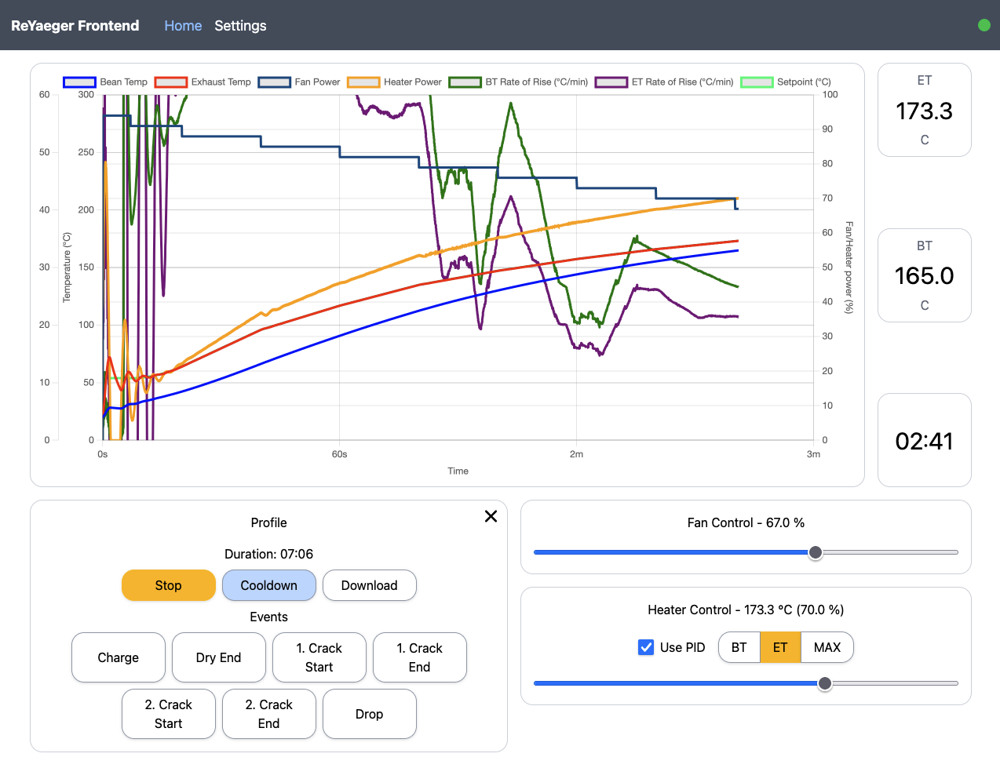

# ReYaeger

This is an alternative frontend for the Yaeger roaster firmware. It can be hosted with the yaeger firmware on an ESP32 S3.

# Key Improvements

- Well-defined messaging loop ensuring the ESP32 does not get overwhelmed. There are 30 updates per second, any PID or manual changes piggyback on those 30 packets. The chart draws a lot smoother as a result.
- Rebuilt from scratch in React - still small enough  to fit on the ESP32 S3 Mini, yet way more common than VanJS, which should make outside contributions easier.
- (TODO) Persistence for PID values and other preferences.
- (TODO) Persistence for most recent profile.
- (TODO) Visual Profile Editor.
- (TODO) Improved manual controls for temperature and fan speed (also supports keyboard inputs using WASD).

# Install

Download the zip file from the release page, drop it into the data folder (create if it does not exist) of your [Yaeger](https://github.com/tadelv/yaeger) project, then remove the line starting with `npm run build` step from Yaeger's `build_and_flash.sh`.

Follow Yaeger's remaining installation instructions and you should end up with a working reyaeger frontend under [http://yaeger.local](http://yaeger.local).

# Build from Source

To build this project from source, ensure you have NodeJS >= 20 running, then run `corepack enable`, after which you should be able to install your dependencies running `yarn install`.

Lastly, you can bundle the project running `yarn run build:release`. The resulting bundled frontend will be available in the `dist` folder, or zipped in the `release` folder.
